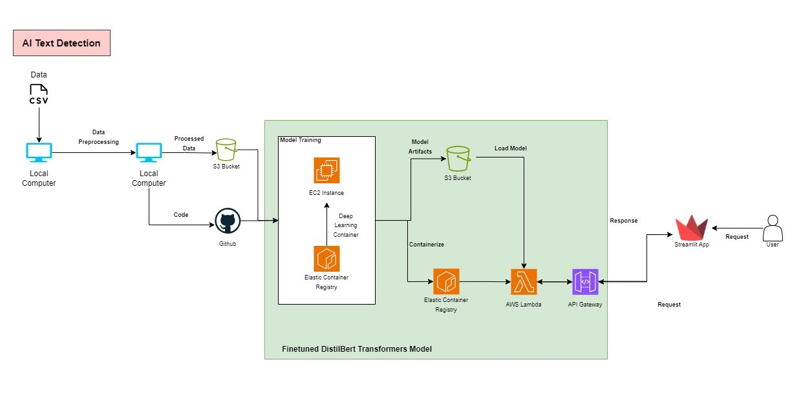
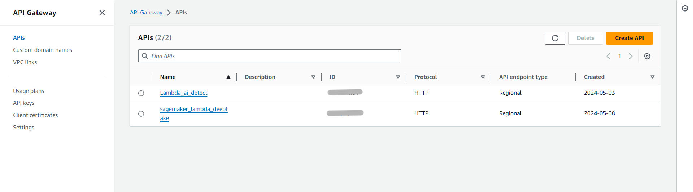
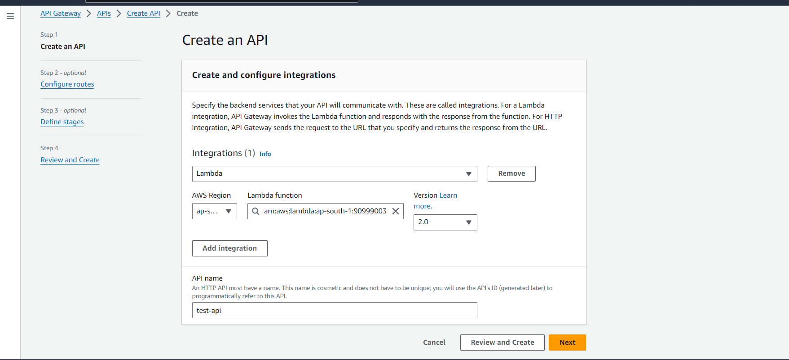
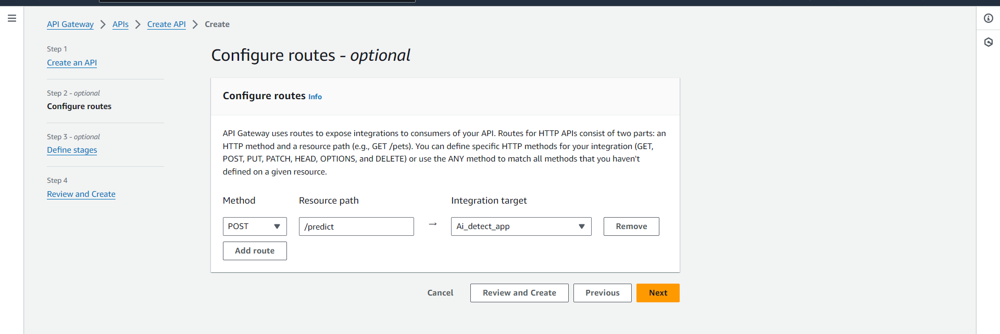
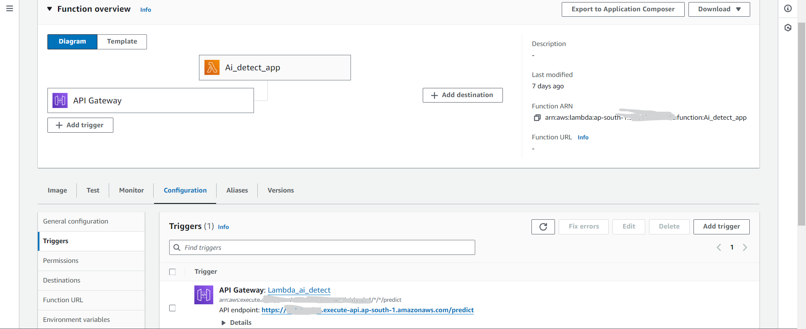

# Finetuned DistilBert Model Deployement for Text Classification
For this deployement, the DistilBert transformer based model was finetuned on custom task specific dataset for text classification.

## AWS Architecture



The above architecture was used for the deployement of the Finetuned DistilBert Model. The data was preprocessed on the local machine first and uploaded to s3. The model was trained on GPu based EC2 instance using deep learning ECR images. Then the trained model artifacts were stored in another s3 bucket, while the docker image was uploaded to Elastic Container Registry (ECR), then Lambda function was created using this ECR image and connected with API Gateway to serve the user request.

## Instructions

Model can be trained on your personal GPU or EC2 machine like here. Once model is trained, save the artifacts on s3. 

### 1. Create a Dockerfile

create a docker file through which we will build the docker image

```
FROM public.ecr.aws/lambda/python:3.10

COPY requirements.txt  .
RUN  python -m pip install --upgrade pip
RUN  yum install gcc -y
RUN  pip3 install -r requirements.txt --target "${LAMBDA_TASK_ROOT}"


# Copy function code
COPY lambda_function.py ${LAMBDA_TASK_ROOT}

#COPY premodels/model_state_dict_5.pth /opt/ml/model_state_dict_5.pth

COPY . ${LAMBDA_TASK_ROOT}

ENV HF_HOME=/tmp/transformers_cache
RUN mkdir -p ${HF_HOME} && chmod -R 777 ${HF_HOME}

CMD ["lambda_function.lambda_handler"]
```

As we will be hosting this image on AWS lambda, we have apply last command in our docker image.

### 2. Build the Docker Image and run it locally.

Build the image from dockerfile using following command

```
docker build -t <IMAGE_NAME_TAG> .
```

Run the lambda image locally

```
docker run -p 9000:8080 <IMAGE_NAME_TAG>
```

To interact with the container locally, we can send the POST request using curl. Open the bash and apply the following command. Since we are sending text for prediction, we need to send dict in format of {'text':'YOUR TEXT FOR PREDICTION'}.

```
curl -XPOST "http://localhost:9000/2015-03-31/functions/function/invocations" -d '{'text':'YOUR TEXT FOR PREDICTION'}'
```
you should get the respnse like:

'statusCode': 200, 'body': { "predicted_label": AI or HUMAN }

That means it works. Now we can deploy this image to ECR.

### 3. Upload docker image to ECR

To deploy the Lambda Function with docker image, the first thing we need to do is to upload the image to AWS ECR(Elastic Container Registry). The first thing we need to do is to run the get-login-password command to authenticate the Docker CLI to your Amazon ECR registry.

```
aws ecr get-login-password --region <YOUR_REGION> | docker login --username AWS --password-stdin <YOUR_AWS_ACCOUNT_ID>.dkr.ecr.<YOUR_REGION>.amazonaws.com
```

Then let's create a repository in AWS ECR using the cerate-repository command:

```
aws ecr create-repository --repository-name <YOUR_REPO_NAME> --image-scanning-configuration scanOnPush=true --image-tag-mutability MUTABLE
```
Next, Run the docker tag command to tag our local image into our Amazon ECR repository as the latest version:

```
docker tag <YOUR_REPO_NAME>:latest <AWS_RepositoryUri>:latest
```

the AWS_RepositoryUri can be found in the response of previous command. Make sure to include :latest at the end of the URI.

Now we can push our local image to the AWS ECR, make sure to include :latest at the end of the URI.:

```
docker push <AWS_RepositoryUri>:latest
```

### 4. Create Lambda Function using ECR image

Now we need to create a lambda function in AWS. I have used AWS Console to create this function. Make sure the region is same as ECR region.

Then we will create the new lambda function by selecting container image and selecting our image uploaded to ECR repo.

Once the lambda function is ready we can test it by creating new test cases.

If there are any changes in the code, you can use the following command only to rebuild the image and connect it with lambda.

```
docker build <AWS_RepositoryUri>:latest .
```
```
docker push <AWS_RepositoryUri>:latest   
```

Then update the lambda function with following command

```
aws lambda update-function-code --function-name <LAMBDA_FUNCTION_NAME> --image-uri <AWS_RepositoryUri>:latest
```
Our Lambda function is ready. You can test the lambda function by creating a test case just like we tested locally.

### 5. Create API Gateway and connect with Lambda

Open the API Gateway dashboard and select create API.



Select the HTTP API and select build. You will see the following screen. Click on integration and select your lambda function and give your API any suitable name.



Next on configuration page, in method select POST and Resource path any name. Here for prediction we will select /predict.  



Keep everything default in next pages and select create to create the api gateway.

Your APi gateway is ready. Go to your lambda function and you will see your api gateway added to triggers.

Go to the configuration -> triggers and you will see your API endpoints.



Now your api is ready, through which you can interact with your Lambda App by sending a request, just like we did locally.

### 6. Test your API
Test with Curl. We can use the following curl command to test our API:
```
curl -X POST "<YOUR_API_ENDPOINTS>" -H "Content-Type:application/json"  -d '{"text":"TEXT THAT YOU WANT TO CLASSIFY"}'
```

If we configure the things correctly, we should see the response like:
'statusCode': 200, 'body': { "predicted_label": AI (or HUMAN)}

